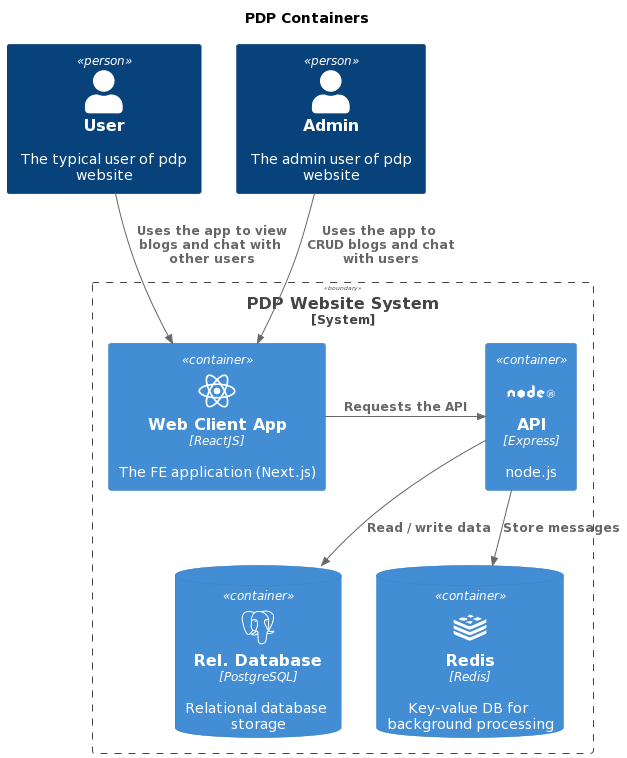

# Rate It
___
## Project description
___
Set of dashboards aimed to provide actual sales data to define and adjust dealership team pace
## Related resources
___
* [GitHub repo](#)
* [Jira](#)
* [Staging](#)
* [SRS](#)
* [Design](#)
* [API Documentation](#)
## Environment variables
___
### Example
```
NEXT_PUBLIC_APP_HOST=
NEXT_PUBLIC_APP_GRAPH_URL=
NEXT_PUBLIC_APP_MUTATION_TOKEN=
```
### Description
* ``NEXT_PUBLIC_APP_HOST`` - API url
* ``NEXT_PUBLIC_APP_GRAPH_URL`` - CMS url
* ``NEXT_PUBLIC_APP_MUTATION_TOKEN`` - Auth token for cms

## Runtime environment
___
The infrastructure of Reate It consists of the following services:
* Web Client App (Next.js)
* API (Express)
* PostgreSQL database
* Redis in-memory database



## Main Branches
____
`development` - using to merge all new changes before the further actions;<br>
`staging` - auto-deploy to [staging](#) is configured for this branch;

## Deployment instructions
___
### Staging deploy
Staging is deployed automatically when there are changes in `staging` branch in a repository.

### Production deploy
Production is deployed when there are changes in `production` branch in a repository(after approved in AWS pipeline).

## Docker
___
Docker file already included into project to create docker image just run `docker build .`

## Commands
___

Clone repo from [gitHub](#)
 ```
 git clone REPO_URL
 cd timeAI
 npm install
 ```

Then you should create `.env` file in the root folder and add there the variables listed in `.env.example` file.

In the project directory, you can run:

### `npm start`

Runs the app in the development mode.<br>

The page will reload if you make edits.<br>
You will also see any lint errors in the console.

### `npm run lint`

Checks your code with ESLint.<br>

### `npm run test`

Run all test.<br>

### `npm run build`

Builds the app for production to the `build` folder.<br>
It correctly bundles React in production mode and optimizes the build for the best performance.

The build is minified and the filenames include the hashes.<br>
Your app is ready to be deployed!
